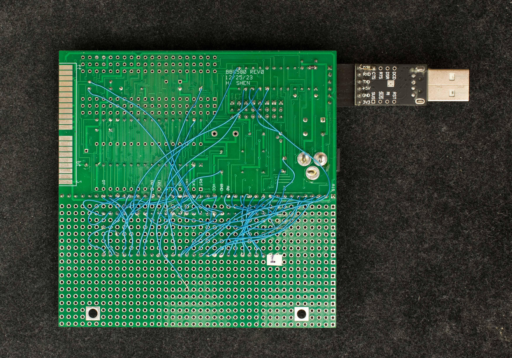
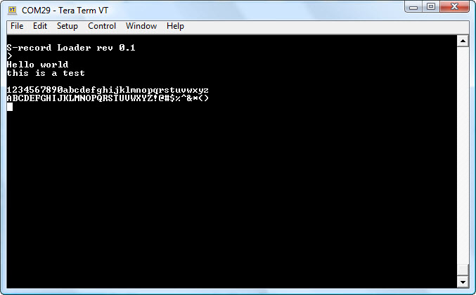

# Barebones 68008 Prototype
Barebones 68008 is a very simple 68008 SBC similar to barebones Z80 and barebones 6502.  The prototype BB68008 is constructed by modifying a BB6580 pc board.



### Features
- 8MHz MC68008
- 128K/512K RAM
- 57600 N82 bit-bang serial port
- Serial bootstrap
- ATF22V10 as glue logic and bootstrap ROM
- 64-byte ROM in ATF22V10

### Theory of Operation
22V10 has 10 outputs; eight of them have large sum-of-product array with 10 to 16 product terms per output. The number of product terms are not the same with pins 17, 18 having 16 product terms while pin 15,22 having 10 product terms. By selectively assigning the most used data bits to output with largest product terms and least used data bits to outputs with smaller product terms, a decent size ROM can be created out of 22V10's logic array. The size of ROM is data dependent and data bit pin assignment. By trials and errors, 40-50 bytes of Z80 or 6502 program can be embedded in 22V10's logic array.

The 10 outputs of a 22V10 can be partition into 8 outputs for 40-50 bytes of ROM, and 2 outputs for RAM page register and register for serial transmitter. The RAM page register is cleared after reset so ROM occupies the entire memory space for read operations. However, RAM is still enabled and can accept data for write operations Another word, ROM is ready-only and RAM is write-only when RAM page register is cleared.

The serial port as implemented in 22V10 is a simple bit-bang serial transmitter and receiver. The serial receiver is a 2K resistor between serial receive terminal and Z80 or 6502's data bit 7; while the serial transmitter is a writable register either in Z80's I/O space or 6502's memory mapped register.

At power up, 22V10-based ROM provides the program for 68008 until location $40 is access which will switch out the ROM and replaced with RAM. While ROM is enabled, the RAM is enabled and writable so the role of ROM bootstrap is to decode incoming serial data and write to itself starting from location $0. When location $40 is written, the ROM is replaced with RAM but the bootstrap program remained the same. When 512 bytes of serial data are received, the program starts at location $40.

```
SerRx    equ $fffffff4
page     equ $fffffffe
         org $0
;serial bootstrap with 22V10
;serial receive is hooked up to D[7]
;CPU clock is 8MHz
         dc.l $8000
         dc.l start
         org $14
start:
         lea $0,a0                 ;start serial load from $0
         move.w #$200,d3            ;write 512 bytes into RAM
setup:
         moveq #7,d1               ;8 bits in serial receive
startBit:
         move.b SerRx,d2
         bmi startBit
         movem d0-d7/a0-a3,(a7)     ;wait 1.5 bit time
getSer:
         asl SerRx                  ; shift into extend bit
         roxr.b #1,d2                 ; D2 holds the received value
         movem d0-d7,(a7)           ;wait 1 bit time
         dbra d1,getSer
         move.b d2,(a0)+
         dbra d3,setup

         bra.s bootend               ;prefetch this instruction
         nop
bootend:
;this is location $40
;loaded program resume execution here.
```

### Design Files
- [Schematic](bb68008_prototype_scm.pdf)
- [ATF22V10 design file](bb68008_prototype_22v10_design_file_serboot.zip)

### Software
- [Serial bootstrap algorithm](bb68008_prototype_serial_bootstrap_in_22v10.zip) embedded in ATF22V10 ROM
- [S-record loader](bb68008_prototype_software_srecord_loader.zip). Send BB68K8Load.bin as binary file first, then send S record file to be loaded and execute at $400
- [Hello world](bb68008_prototype_software_helloworld_demo.zip) demonstration software

  

